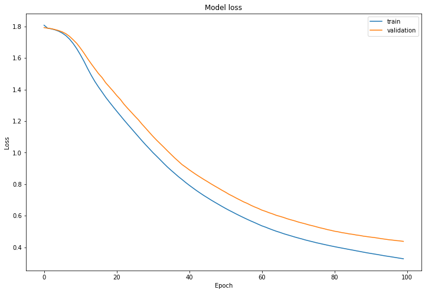
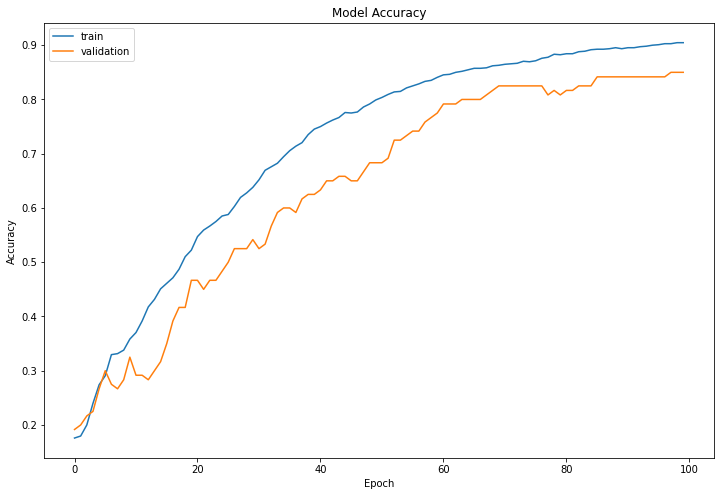

# Implementation of Convolutional Neural Network (CNN) with Numpy

This project implements a Convolutional Neural Network (CNN) step-by-step using numpy. The goal of this project is to understand the key components of CNNs, including convolution and pooling layers, and build a CNN from scratch and also used the Tensorflow framework for binary/multiclass classification.

## Table of Contents

- [Introduction](#introduction)
- [Convolution Operation](#convolution-operation)
- [Max Pooling Operation](#max-pooling-operation)
- [Components of CNN](#components-of-cnn)
- [Implementation](#implementation)
- [Results](#Results)

## Introduction

In this project, we'll implement the basic building blocks of a CNN, namely the convolution (CONV) and pooling (POOL) layers. We'll start by explaining the convolution operation and the max pooling operation, which are fundamental to CNNs. Then, we'll proceed with the step-by-step implementation of these layers using numpy.

By the end of this project, we'll be able to:
- Explain the convolution operation and its role in CNNs.
- Apply two different types of pooling operations to downsample feature maps.
- Identify the components used in a convolutional neural network (padding, stride, filter, etc.) and understand their purpose.
- Build a convolutional neural network from scratch using numpy.

## Convolution Operation

The convolution operation involves sliding a small filter (kernel) over an input image (feature map) to produce an output feature map. The filter's elements are learnable parameters of the CNN. The process of convolution includes element-wise multiplication and summation to compute the output feature map.

## Max Pooling Operation

Max pooling is a downsampling technique used to reduce the spatial dimensions of the feature maps while retaining the most important information. It involves partitioning the feature map into non-overlapping regions and taking the maximum value from each region to form the pooled feature map.

## Components of CNN

In a Convolutional Neural Network (CNN), several components play vital roles in the overall architecture:
- **Padding**: Padding the input image allows preserving the spatial dimensions of the feature map after applying convolution or pooling layers.
- **Stride**: Stride defines the step size at which the convolutional filter slides over the input image.
- **Filter**: The filter (kernel) is a small window of learnable parameters used in the convolution operation to extract features.
- **Pooling**: Pooling layers downsample the feature maps to reduce computational complexity and extract the most important features.

## Implementation

- The implementation of the Convolution and Max Pooling layers will be done in Python using numpy, a powerful library for numerical computations.
- Build and train a ConvNet in TensorFlow for a binary classification problem (happy face or not)
- Build and train a ConvNet in TensorFlow for a multiclass classification problem (hand sign recognition)

## Results
- succesffully implemented and tested CNN forward and backpropogation with sample test cases
- Test accuracy : 88 % for binary classification
- Test accuracy : 80 % for multiclass classification

## Sources

- Foundation of ML (CS725)
- Coursera Deep learning specilization
